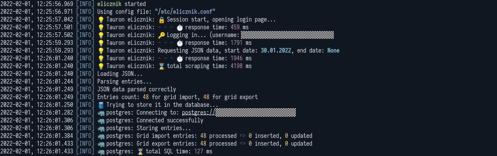

# 💡 elicznik

[](https://crates.io/crates/elicznik)
[](https://crates.io/crates/elicznik)

## About
A commandline tool for scraping energy meter data from [Tauron eLicznik](https://elicznik.tauron-dystrybucja.pl/) service.
The data are fetched in the JSON format. It consists of hourly records of energy imported and exported from/to grid.
By default obtained data is stored in the PostgreSQL database, but this tool can also save the data directly to a JSON file.
It can also load a data from the JSON (instead of using `Tauron`) and then save it in the database.

## Usage
```
elicznik 0.1.0
Simple program to fetch and process `Tauron eLicznik` JSON data. If none arguments are given, it is
fetching last two days of data and updates missing values in the configured PostgreSQL database

USAGE:
    elicznik [OPTIONS]

OPTIONS:
    -c, --config <CONFIG>    Config file path [default: /etc/elicznik.conf]
    -d, --debug              Enable debug info
    -e, --end <END>          End date in format: YYYY-MM-DD [default: current date]
    -h, --help               Print help information
    -i, --input <INPUT>      Input JSON file to read instead of using `Tauron eLicznik`
    -o, --output <OUTPUT>    Output JSON file to write output data (database will be also updated,
                             if configured)
    -p, --print              Print all JSON entries
    -s, --start <START>      Start date in format: YYYY-MM-DD [default: two days ago]
    -V, --version            Print version information
```

The `Tauron` service is providing the data with some delay. Generally the last data available is for a previous day,
but even then it is sometimes not complete. This tool is intended to run in a daily manner to be able to fetch all data.
Due to described data availability the program by default is trying to start fetching data from day before yesterday.
One can always adjust it to one's need by providing `start` and `end` parameters as described above.

## Sample run


## Config file
If not specifed, the tool is searching for the following config file:<br>
`/etc/elicznik.conf`<br>

A sample file may have the following contents:<br>
```
[tauron]
username = your_tauron_username
password = your_password

[postgres]
host = 192.168.1.1
dbname = database_name
username = database_user
password = database_password
```
